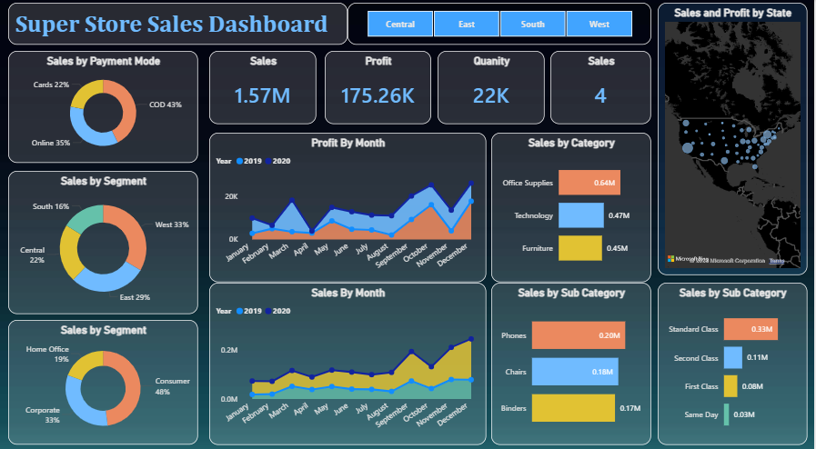
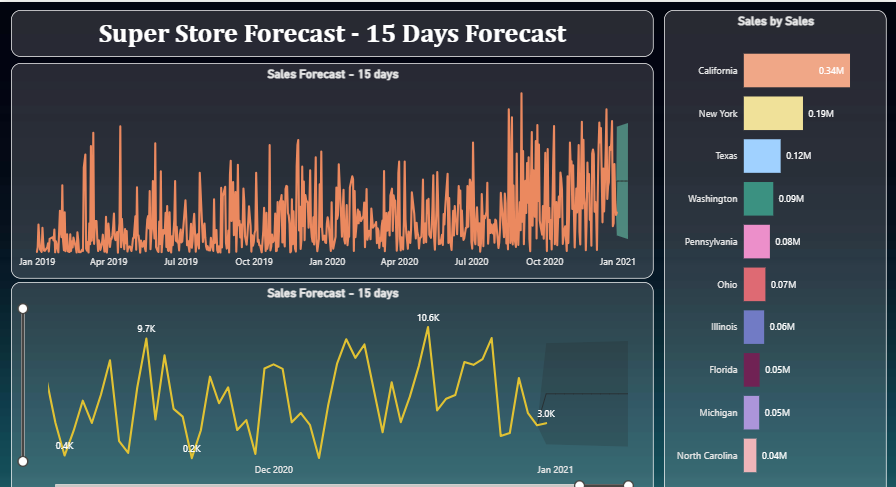

# 🛒 Super Store Sales Dashboard

> Leveraging time series analysis and interactive Power BI dashboards to deliver actionable sales insights and accurate 15-day forecasting for business decision-making.

---

## 📊 Dashboard Preview

### Sales Dashboard

### Sales Forecast Dashboard

---

## 🎯 Objective

To incorporate data analysis techniques, specializing in **time series analysis**, to deliver:
- Valuable business insights across regions, categories, and customer segments
- Accurate **15-day sales forecasting** using historical trends
- Interactive dashboards enabling data-driven decision-making

---

## 📌 Key Metrics

| Metric | Value |
|--------|-------|
| 💰 Total Sales | $1.57M |
| 📈 Total Profit | $175.26K |
| 📦 Total Quantity Sold | 22,000 units |
| 📅 Data Period | 2019 – 2020 |

---

## 💡 Key Insights Uncovered

- 🏆 Office Supplies dominates sales at $0.64M, making it the top-performing category
- 👥 Consumers drive nearly half of all sales (48%), followed by Corporate clients at 33%
- 💳 Cash on Delivery remains king at 43% — a big opportunity to nudge customers toward digital payments
- 🌍 The West region leads with 33% of sales, and California alone contributes $0.34M
- 📦 Standard Class shipping is overwhelmingly preferred at $0.33M — far ahead of other modes
- 🔮 The 15-day forecast projects daily sales between $3K – $10.6K as we enter early 2021

## 🔍 Dashboard Features

### Page 1 – Sales Dashboard

- **Sales by Category** — Office Supplies leads at $0.64M, followed by Technology ($0.47M) and Furniture ($0.45M)
- **Sales by Segment** — Consumer (48%), Corporate (33%), Home Office (19%)
- **Sales by Payment Mode** — COD (43%), Online (35%), Cards (22%)
- **Sales by Region** — West (33%), East (29%), Central (22%), South (16%)
- **Sales by Sub-Category** — Top performers: Phones ($0.20M), Chairs ($0.18M), Binders ($0.17M)
- **Sales by Ship Mode** — Standard Class dominates at $0.33M
- **Monthly Sales & Profit Trends** — Year-over-year comparison (2019 vs 2020)
- **Sales and Profit by State** — Geographic map visualization across the US

### Page 2 – 15-Day Sales Forecast

- **Time Series Forecasting** — Built-in Power BI forecasting to predict sales for the next 15 days
- **Top States by Sales** — California ($0.34M), New York ($0.19M), Texas ($0.12M)
- **Forecast Confidence Intervals** — Upper and lower bounds for predicted sales

---

## 💡 Key Insights

- 📦 **Office Supplies** is the highest-selling category, but **Technology** may yield higher profit margins
- 💳 **COD** is the most preferred payment mode (43%) — an opportunity to promote digital payments
- 🌍 The **West region** drives the most sales (33%), with **California** being the top state at $0.34M
- 📈 Sales show a clear **upward trend** toward Q4, indicating seasonal demand spikes
- 🔮 The 15-day forecast predicts sales ranging between **$3K–$10.6K per day** in early 2021

---

## 🛠️ Tools & Technologies

| Tool | Purpose |
|------|---------|
| Power BI Desktop | Dashboard creation & visualization |
| Power BI Forecasting | Time series analysis |
| Microsoft Bing Maps | Geographic sales mapping |
| Excel / CSV | Data source preparation |

---

## 📂 Dataset

- **Source:** [Kaggle – Super Store Dataset](https://www.kaggle.com/datasets/vivek468/superstore-dataset-final)
- **Records:** ~10,000 transactions
- **Period:** January 2019 – December 2020
- **Fields:** Order ID, Category, Sub-Category, Region, Segment, Sales, Profit, Quantity, Payment Mode, Ship Mode

---

## 🚀 How to View the Dashboard

1. Download the `.pbix` file from this repository
2. Install [Power BI Desktop](https://powerbi.microsoft.com/desktop/) (free)
3. Open the file in Power BI Desktop
4. Use the **region filters** (Central / East / South / West) to explore regional data

---

## 📄 License

This project is open source and available under the [MIT License](LICENSE).
